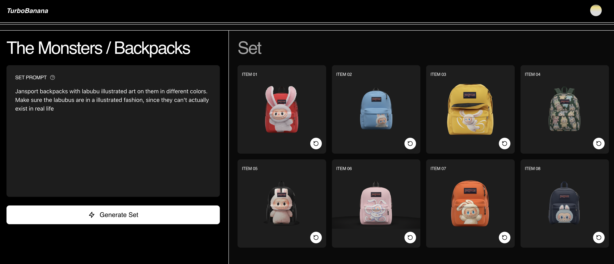

# Banana Bunch

A novel consumer product for brands to rapidly iterate on their assets or product lines.

With the introduction of Nano Banana, AI image models have shown for the first time a remarkable ability to keep style consistent cross multiple images. Banana Bunch leverages this new ability to let brands just upload a few style/brand photos and then create "sets" of things that align with that style.

## Examples

This is great for things like character asset generation (e.g. NPCs, plants, etc.) and product lines. Here are some examples we made of brand styles and asset sets:

<div >
  
  
  
  
</div>

-----
## Getting Started

First, run the development server:

```bash
npm run dev
# or
yarn dev
# or
pnpm dev
# or
bun dev
```

Open [http://localhost:3000](http://localhost:3000) with your browser to see the result.

## Deploy on Vercel

The easiest way to deploy your Next.js app is to use the [Vercel Platform](https://vercel.com/new?utm_medium=default-template&filter=next.js&utm_source=create-next-app&utm_campaign=create-next-app-readme) from the creators of Next.js.

Check out our [Next.js deployment documentation](https://nextjs.org/docs/app/building-your-application/deploying) for more details.
